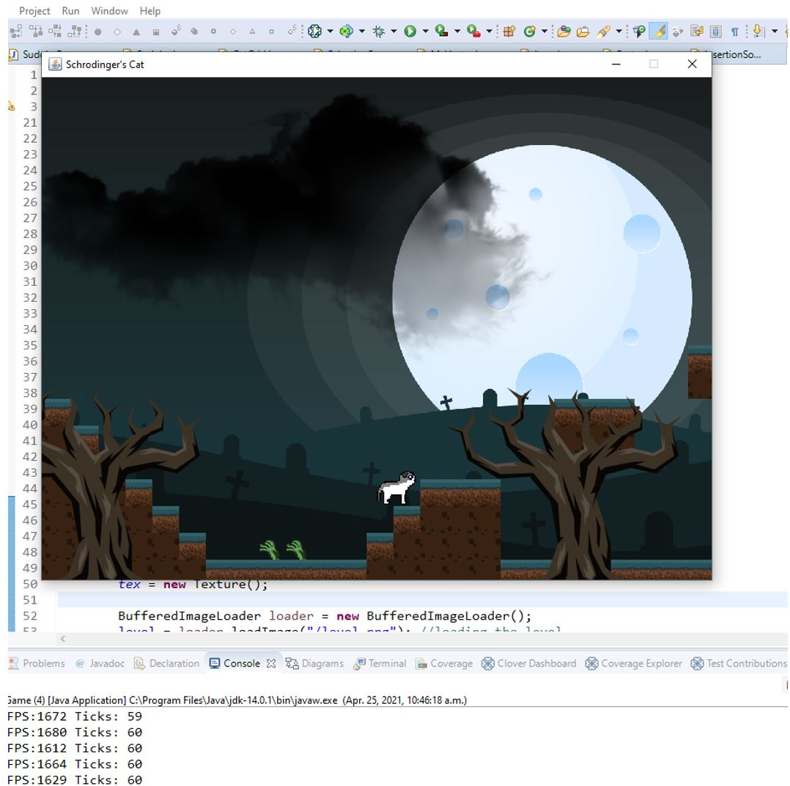

# Mario-like-game-But_With_Cat
## a game like Mario, but with Schrodinger's cat. still in progress

# install Directions:
## 1.) git pull
## 2.) create a new Javaproject in Eclipse, using folder "videogame" within "mario-like-game-but-with-cat" folder.
## 3.) run the game, by entering "Game.java" file within eclypse

# Game Play Instructions:
## touch the grave stones to complete the level
## dont get hit by enemies (zombies, or hands)
## jump with spacebar
## move with arrow keys, OR 'A','W', and 'D' (recomended)
## mouse button to shoot hair balls at enemies

